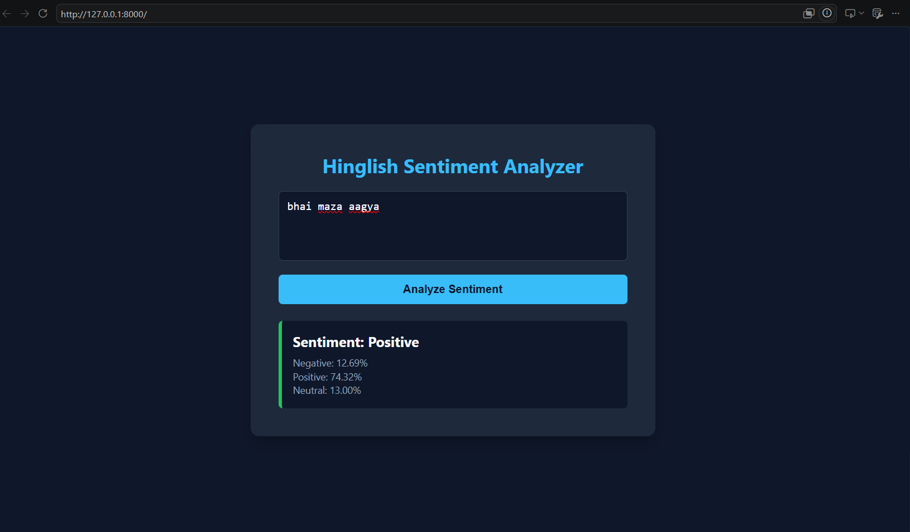
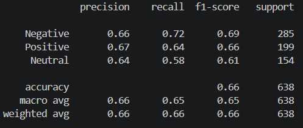

# Hinglish Sentiment Analyzer 🇮🇳💬

A Deep Learning based Sentiment Analysis Web Application that classifies Hinglish (Hindi + English) YouTube comments into:

- 😊 Positive
- 😐 Neutral
- 😡 Negative

The project uses Google's **MuRIL (Multilingual Representations for Indian Languages)** transformer model fine-tuned on a Hinglish YouTube comments dataset and deployed using **FastAPI**.

---

## 📌 Project Overview

Hinglish is widely used across Indian social media platforms, but traditional English sentiment models often fail to understand mixed Hindi-English text.

This project fine-tunes Google's MuRIL model on a Hinglish sentiment dataset and serves predictions through a FastAPI web application with an interactive frontend.

Example:

| Input Comment | Prediction |
|-------------|------------|
| bhai maza aagya | Positive |
| ye video thik hai | Neutral |
| bakwas content hai | Negative |

---

## 🚀 Features

- Fine-tuned MuRIL transformer model
- 3-class sentiment classification
- FastAPI backend
- Interactive frontend UI
- Confidence score visualization
- REST API endpoint
- Local model loading (no internet required after training)

---

## 🛠️ Tech Stack

### Deep Learning
- PyTorch
- Hugging Face Transformers
- MuRIL (google/muril-base-cased)

### Backend
- FastAPI
- Uvicorn

### Data Processing
- Pandas
- NumPy
- Scikit-Learn
- Hugging Face Datasets

### Frontend
- HTML
- CSS
- JavaScript

---

## 📂 Project Structure

```bash
hinglish-sentiment/
│
├── data/
│
├── images/
│   ├── Matrix.jpg
│   └── UI.jpg
│
├── models/
│   └── muril-hinglish/
│       ├── config.json
│       ├── model.safetensors
│       ├── tokenizer.json
│       ├── tokenizer_config.json
│       └── training_args.bin
│
├── notebook/
│   └── explore.ipynb
│
├── src/
│   ├── static/
│   │   └── index.html
│   │
│   ├── app.py
│   └── train.py
│
├── requirements.txt
├── README.md
└── .gitignore
```

---

## 📊 Dataset

Dataset Source:

https://huggingface.co/datasets/shae2977/hinglish-youtube-sentiments-dataset

Dataset Statistics:

| Class | Samples |
|---------|---------|
| Negative | 1427 |
| Positive | 993 |
| Neutral | 770 |
| Total | 3190 |

The dataset contains Hinglish YouTube comments labeled into:

- Negative
- Positive
- Neutral

---

## 🧠 Model Architecture

### Base Model

```python
google/muril-base-cased
```

MuRIL is specifically trained for Indian languages and multilingual text, making it highly effective for Hinglish sentiment classification.

### Training Configuration

| Parameter | Value |
|------------|--------|
| Epochs | 5 |
| Batch Size | 16 |
| Max Length | 128 |
| Learning Rate | 3e-5 |
| Weight Decay | 0.01 |
| Warmup Steps | 100 |
| Optimizer | AdamW |
| Loss Function | Weighted Cross Entropy |

---

## ⚙️ Training

Run:

```bash
cd src

python train.py
```

The script:

- Downloads dataset
- Splits data into train/validation sets
- Tokenizes comments
- Fine-tunes MuRIL
- Saves best model
- Generates evaluation metrics

Saved model:

```bash
models/muril-hinglish/
```

---

## 📈 Model Performance

### Classification Report

```text
              precision    recall  f1-score   support

    Negative       0.66      0.72      0.69       285
    Positive       0.67      0.64      0.66       199
     Neutral       0.64      0.58      0.61       154

    accuracy                           0.66       638

   macro avg       0.66      0.65      0.65       638
weighted avg       0.66      0.66      0.66       638
```

### Validation Metrics

| Metric | Score |
|----------|--------|
| Accuracy | 66% |
| Macro F1 | 65% |
| Weighted F1 | 66% |

---

## 🌐 Running the Web App

Move to source directory:

```bash
cd src
```

Start FastAPI server:

```bash
uvicorn app:app --reload
```

Open:

```text
http://127.0.0.1:8000
```

---

## API Endpoint

### POST /predict

Request:

```json
{
    "comment": "bhai maza aagya"
}
```

Response:

```json
{
  "comment": "bhai maza aagya",
  "sentiment": "Positive",
  "confidence_scores": {
    "Negative": 0.1269,
    "Positive": 0.7432,
    "Neutral": 0.1300
  }
}
```

---

## 📷 User Interface

### Application UI



### Model Performance



---

## 🔧 Installation

Clone repository:

```bash
git clone https://github.com/your-username/hinglish-sentiment.git

cd hinglish-sentiment
```

Create virtual environment:

```bash
python -m venv myenv
```

Activate:

### Windows

```bash
myenv\Scripts\activate
```

### Linux / Mac

```bash
source myenv/bin/activate
```

Install dependencies:

```bash
pip install -r requirements.txt
```

---

## Future Improvements

- Larger Hinglish dataset
- Better class balancing
- Data augmentation
- DistilMuRIL deployment
- Docker support
- Hugging Face Spaces deployment
- Streamlit version
- Real-time YouTube comment analysis

---

## 👨‍💻 Author

**Devansh Kumar Pandey**

B.Tech Electronics Engineering  
Harcourt Butler Technical University (HBTU), Kanpur

Skills:
- Python
- Machine Learning
- Deep Learning
- FastAPI
- NLP
- PyTorch

---

## ⭐ Acknowledgements

- Google Research for MuRIL
- Hugging Face Transformers
- Hugging Face Datasets
- FastAPI
- Scikit-Learn

---

### If you found this project useful, consider giving it a ⭐ on GitHub.